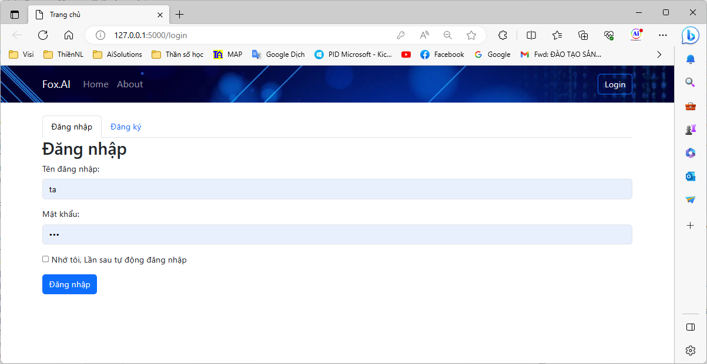
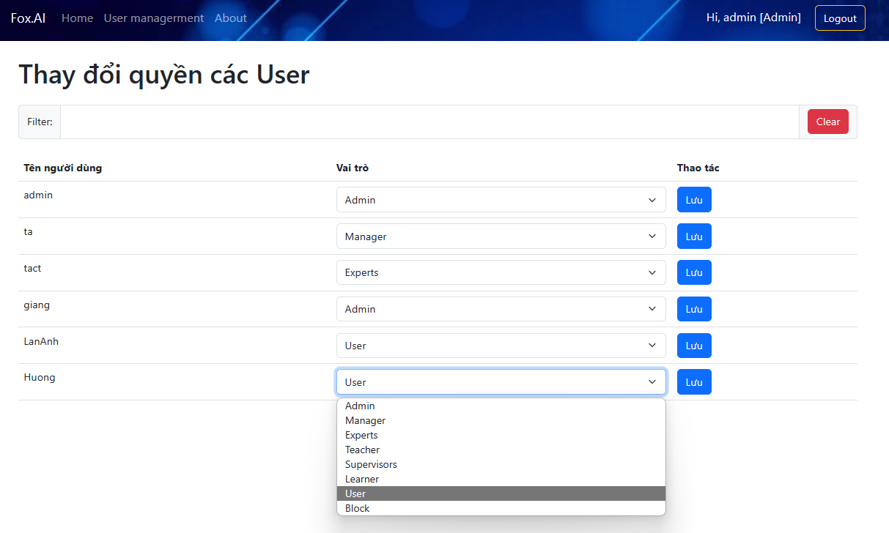

# Web Login

# Mục tiêu:
Dùng Flask, bootstrap5, html5, js, jquery, hãy viết một trang index và trang login, create user, database 
dùng SQLite có phân quyền User: Admin, Manager, Experts, Teacher, Supervisors, Learner, Guest, Block (trong `AiLibs/Flask_Login/templates/Modules/admin.html`) 




Pass mặc định: 123

# Yêu cầu:
- Đọc hiểu và có thể làm lại web này.
- Viết thêm module thay đổi thông tin cá nhân, đổi pass, có ảnh avatar (lưu thông tin user trong `static/users/...` nếu cần).

 

# Cách làm chương trình hiện có:
Dưới đây là một ví dụ về cách sử dụng Flask, Bootstrap 5, HTML5, JavaScript và jQuery để tạo trang index, trang đăng nhập và trang tạo người dùng. Đây chỉ là một ví dụ cơ bản để bạn có thể bắt đầu, và có thể được tùy chỉnh và mở rộng theo nhu cầu của bạn.

Đầu tiên, cài đặt các thư viện cần thiết thông qua pip:

`pip install flask`


## Cài đặt:
```bash
pip install -r req.txt
```
hoặc vào trong thư mục `wheelhouse`, làm theo `Máy chạy:` trong  `readme.txt` trong đó.

## Run:
```bash
python app.py
```

## Tính năng chính của chương trình
Chương trình có các chức năng chính sau:
1. Quản lý User.
   - Đăng ký user.
   - Đăng nhập/đăng xuất.
   - Phân quyền: khi user hiện tại là admin thì menu này sẽ hiện lên.
   - Tự động lưu trạng thái đăng nhập của User ở phiên làm việc trước đó thời gian lưu là 3 tháng.
   - Cơ sở dữ liệu là SQLite3, có thể xoá file database đi để chương trình tự tạo file mới. Lúc này không có user mặc định. Cần set quyền admin trực tiếp trong DB.    
 


# Hướng dẫn sử dụng Macro, import, input trong Jinja2 template
Tham khảo [tại đây](https://jinja.palletsprojects.com/en/2.11.x/templates/#import)

1. viết code cho: `templates/taMacros.html`, code này cần bootstrap4/5 để chạy được.
```html

<form >
    <div class="input-group mt-4">
        <span class="input-group-text" style="width:{{label_width}};">{{mlabel}}</span>
        <input type="text" class="form-control" id="{{mID}}NameInput" value= "{{ initValue }}" required >
        <span class="input-group-text">
            <button type="button" class="btn btn-primary" onclick="{{fnName}}('{{mID}}')"  style="width:{{button_width}};">{{btnText}}</button>
        </span>
    </div>
</form>
<br>

```

2. Trong file cần sử dụng, ví dụ: `templates/Modules/admin.html`, vì khác thư mục, nên import nó sẽ khác (cần lên thư mục cha).
```html
        
        {{ forms.forminput('search', 'Filter:', "", "Search" ) }}
```
3. 